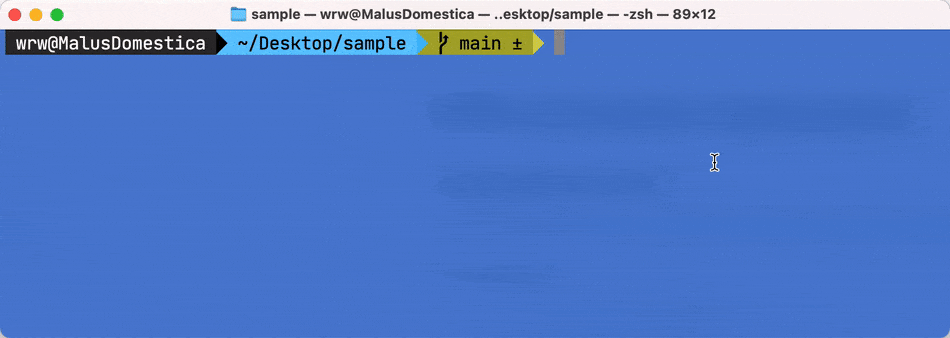

# XRPL transaction signing demo

### TypeScript / JavaScript

This repository [contains TypeScript (compiles to JavaScript) sample code](https://github.com/WietseWind/XRPL-JS-TS-demo/blob/main/index.ts) to compose, sigin & submit an XRP Ledger transaction.

#### Prerequisites

- [Node 12+ installed](https://nodejs.org/en/download/) on your PC
- A decent code editor like [Visual Studio Code](https://code.visualstudio.com/download)
- Basic JS/node knowledge, or a lot of curiosity

#### Preparation

1. [Download this repository (ZIP)](https://github.com/WietseWind/XRPL-JS-TS-demo/archive/refs/heads/main.zip) and extract
2. Start a terminal window (eg. Bash, ZSH, Powershell) in the folder where you extracted the source code downloaded & extracted in the previous step
3. Install the dependencies by running `npm install` (The `npm` binary will be available on your computer if you have Node installed, see prerequisites)

#### Development & running

The source code (`index.ts`) is written in TypeScript. To run this code on your computer you will first have to generate a JavaScript version of this file. To do this, run:

`tsc`

If there are no errors, the generated `index.js` file will be in the `dist/` folder. You can then run the code:

`node dist/index.js`

If you want to compile `index.ts` to `dist/index.js` while you're editing, you can open a second terminal window, and run the TypeScript compiler in 'watch' mode. Just leave the terminal window open, your TypeScript code will automatically compile to JavaScript whenever you change & save something.

`tsc -w`

When the TypeScript compiler is running in 'watch' mode, you can run the JavaScript execution of `dist/index.js` in delayed watch mode as well with the `nodemon` tool. To install `nodemon` globally, run:

`npm install -g nodemon`

Now you can run:

`nodemon dist/index.js`

#### WARNING!

If you run the TypeScript compiler in watch mode and run your compiled code with `nodemon`, every time you change something you will automatically execute code, potentially resulting in sending an XRPL transaction **ON EVERY CHANGE! ONLY DO THIS ON TESTNET!**
